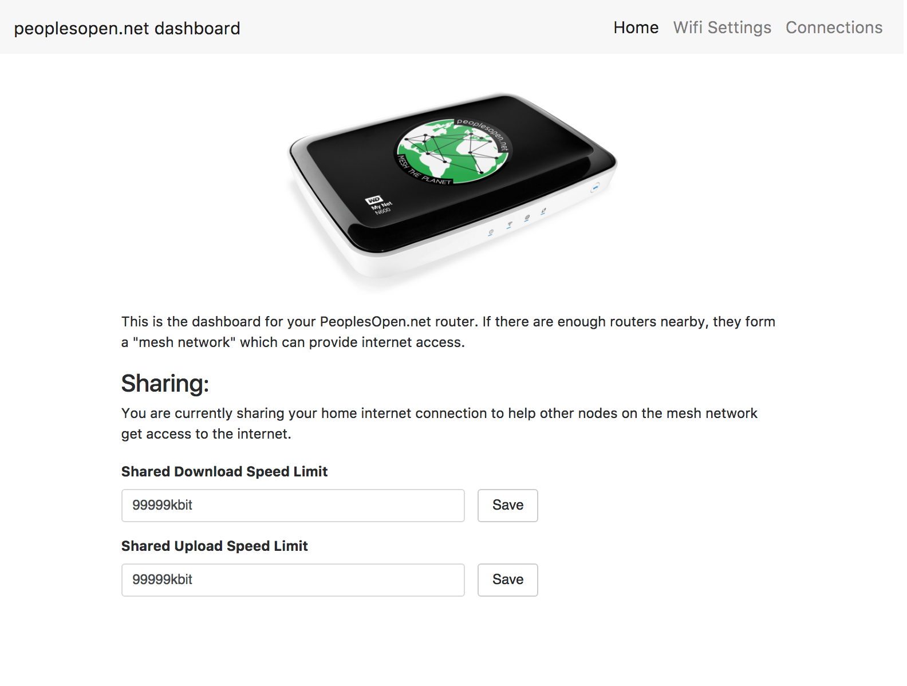
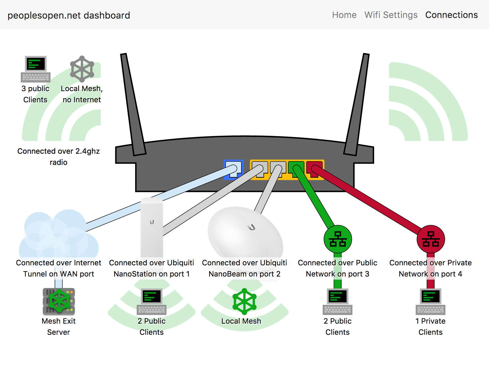
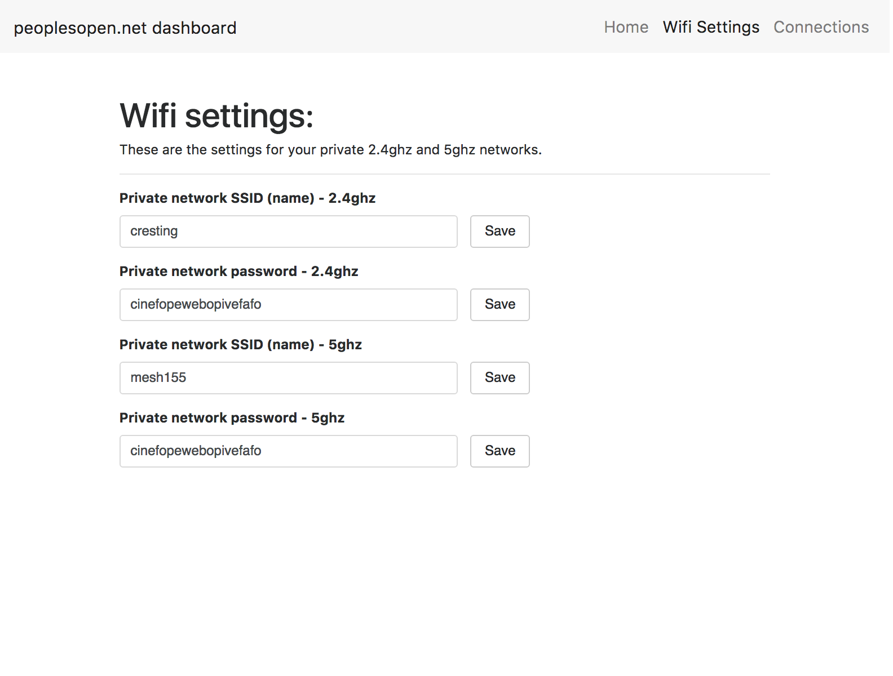

# PeoplesOpen.net dashboard

This is the dashboard that is shown to users of PeoplesOpen.net to allow them to learn about and configure their home nodes. It has 2 main goals: allow less-advanced users to see what their node has been doing and to allow more-advanced users to configure their node more easily.

For the less-advanced users, the front page has some statistics and information about their node, such as what neighbors it is connected to, how much it has shared, etc. This information is designed to present a friendly face and make the idea of mesh networks fun and approachable. Another goal of this page is to convert people from just hosting a home node to actually sharing their bandwidth.

For the more-advanced users, there are in-depth configuration options, as well as a diagram of the router's connection to help debug installations.

## How to develop on this app

To write code for this app, you need a PeoplesOpen.net home node. This is because the backend is run with OpenWRT's [ubus](https://wiki.openwrt.org/doc/techref/ubus) system. It may also be possible to run this in a virtual machine, but it hasn't been tried.

It's probably easiest to ask someone for one of the pre-flashed nodes that we keep on hand, but in case you want to flash your own, check the [wiki](https://sudoroom.org/wiki/Mesh/WalkThrough). If the node is correctly flashed, you should be able to connect to the node's private wifi or ethernet network and `ping 172.30.0.1` should return something like `64 bytes from 172.30.0.1: icmp_seq=0 ttl=64 time=1.067 ms`.

Now, run `npm start` from this directory, and open Chrome with the [--disable-web-security and --user-data-dir](http://stackoverflow.com/questions/3102819/disable-same-origin-policy-in-chrome) flags. You should be able to log into the control panel (you'll need the admin password of course) at localhost:3000 and see it live-update as you edit the code.

## Application architecture

This is meant to be a pretty typical React-Redux application. You should be able to read about all the concepts used in the documentation for these libraries:

- [Redux](http://redux.js.org)
- [React](https://facebook.github.io/react/)
- [Redux-thunk](https://github.com/gaearon/redux-thunk)

## Screenshots

----

----
